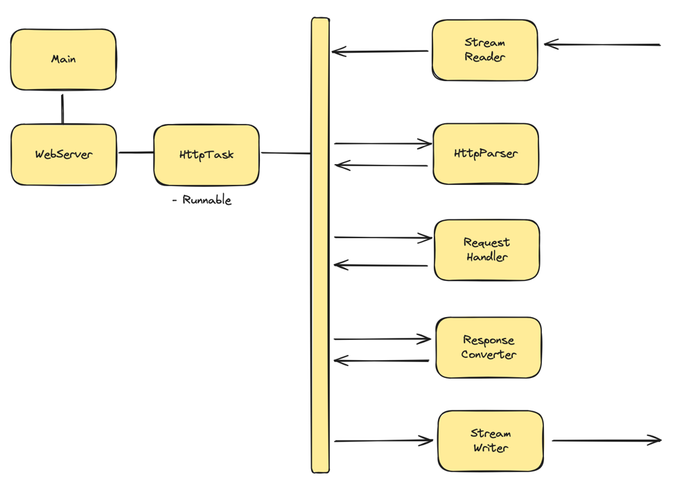

# Java WAS

2024 우아한 테크캠프 프로젝트 WAS

---

# 프로젝트 구조
- 사용자 요청이 들어이 들어오면 HttpTask가 스레드풀에서 실행됩니다.
- StreamReader: 사용자 소켓 입력을 받음
- HttpParser: HttpRequest로 변환
- RequestHandler: HttpRequest를 해석하여 HttpResponse 작성
- ResponseConverter: HttpResponse를 전송을 위해 byte[] 형태로 변환
- StreamWriter: 소켓을 통해 처리결과를 출력

